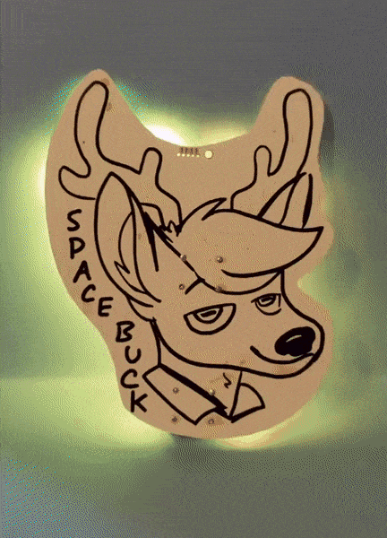
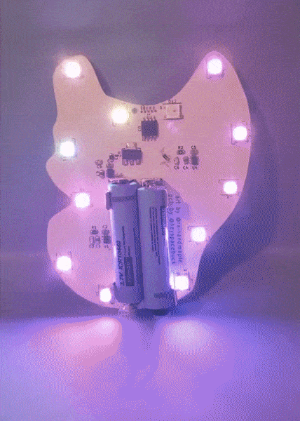
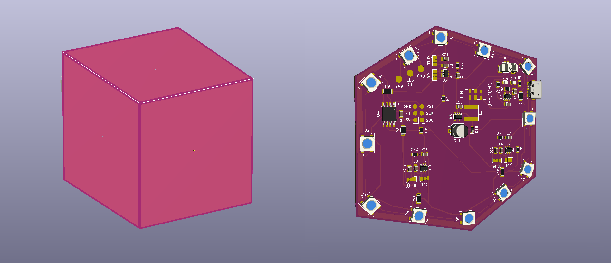

# Space Buck's Space Badge

## Thoughts on designing a con badge with boopability

You probably don't need to be told that con badges are useful. Meeting someone in-person when you've only ever seen their avatar and username can be disorienting! This is especially true for real-life events in the furry fandom. A good fur con badge isn't just a nametag, it also shows off some facet of the wearer's personality. "Oh I know that panther, they're good at metalworking," "Oh I know that bear, she cards her own yarn," "Hey it's Space Buck, he makes goofy electronics!"

Naturally I thought it would be fun to make a PCB con badge for myself. The obverse face has, well, my face, and three large copper pours for capacitive touch purposes. The reverse has twelve WS2812B addressable LEDs, an ATtiny85, and a trio of dead-simple AT42QT1011 capacitive touch sensors. It's powered by a pair of 10440 li-ion cells and a 5V LDO, simply because I have a ton of those lying around. The ATtiny85 is programmed in-circuit with a SOICbite connector. In theory I could have just used the SOIC clip as intended, but for whatever reason I can never get them to make secure connections that way.

How it works: The copper pours under the nose and the antlers are the only inputs and the RGB LEDs are the only outputs. Booping the snoot turns the system on or off. When on, one of six FastLED patterns plays across the LEDs. To switch to the next/previous patterns, just touch the right/left antlers.

The cute art is by [Fenn, @rainandmaple on Twitter](https://twitter.com/rainandmaple)! I got white soldermask because I intend to paint it someday. The git repo contains the circuit I used, but not Fenn's artwork. I don't recommend using the same circuit I used! Which brings us to future hardware improvements....

## Future hardware improvements

I'm happy with the badge for myself, but if I were making one for someone else, I'd put a lot more care into it. A physical power switch, for sure. A more normal Li-Po pouch battery, and a built-in USB charge circuit (sorry not sorry, I'm still using USB Micro B ports on all my designs). More LED patterns. I've designed a proof-of-concept circuit but haven't tried it for real yet.

### Power consumption

It should be easy to set up deep-sleep mode on the ATtiny85 and wait for an interrupt to turn the LEDs on. I suppose it's still possible to update this version to do that; I'd just have to update the code. In fact, I think I will do that!

...

Okay I'm back, the badge now enters deep-sleep mode when the lights are off and turns back on with a pin change interrupt. Now I know to attach this specific touch sensor to the INT0 pin (PB0, pin 5) for an easier time detecting rising-edge interrupts only.

### Power supply

The first badge's power system is bad: two 10440 li-ion cells in series, dropped to 5V with an LDO. I only did this because those were the parts I had on-hand. Were I building this for someone else, I'd use a regular pouch li-po cell, something in the 350-500 mAh range, and a boost converter like the TPS613222A to get the 5 volts expected by the WS2812b LEDs. And, of course, a built-in recharging circuit. I'd also add a physical power switch. We don't want the cap-touch sensors turning the badge on at inopportune times.

### Programming

Goodbye, SOICbite. The next version of the badge will have *no* visible copper on the obverse face. The SOICbite is lovely but as long as I'm using a SOIC-8 microcontroller I should just use the SOIC clip as intended. That said, I have trouble with keeping my SOIC clip to secured on the IC, and I like offering large pads for soldering wires to, so I've also stuck on some SMD pads that can be soldered to or probed with pogo pins.

The light show patterns are demos from the FastLED Arduino library. When compiled the current sketch uses about 70% of the ATtiny85's 8k flash, and about 40% of the RAM, so there's plenty of room for new features.

### Part flexibility

Ah, the chip shortage. Judging by the AT42QT101x lead times, I won't be using that IC in any designs for a while. The TTP223, which is a similar and much cheaper chip, is still available from many places, so I can adjust my designs to use that without much fuss. Alternately, I'd like to try turning some ATtiny10's into cap-touch sensors! The datasheet promises that Atmel's QTouch capacitive touch library is supported, but the actual documentation and libraries are nearly impossible to find on their website. Someone from Microchip guided me through the maze of broken links to get to some inscrutable libraries and an ATtiny10-specific tool that I'd describe as "so Visual Basic it hurts". It will take some time (and I'll have to find my HV programmer) but that's something to look forward to.